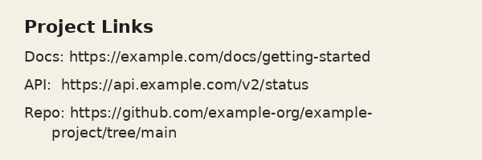

# image-link-extractor

Extract URLs from images using Tesseract OCR. Deterministic, free, local-only — no cloud APIs or deep learning models.

## Features

- Extracts URLs from screenshots, slides, and photos
- Handles URLs that wrap across multiple lines
- Fixes common OCR artifacts in hex-heavy URL segments (e.g. git hashes, gist IDs)
- Preprocesses images (grayscale, upscaling) for better OCR accuracy
- Processes multiple images in a single run

## Prerequisites

[Tesseract OCR](https://github.com/tesseract-ocr/tesseract) must be installed on your system:

```bash
# Fedora / RHEL / CentOS
sudo dnf install tesseract

# Ubuntu / Debian
sudo apt install tesseract-ocr

# macOS
brew install tesseract
```

## Installation

```bash
pip install -r requirements.txt
```

## Usage

```bash
python extract_links.py <image_path> [image_path2 ...]
```

### Examples

```bash
# Single image
python extract_links.py screenshot.png

# Multiple images
python extract_links.py slide1.png slide2.png slide3.png
```

### End-to-end example

A sample image is included in [`examples/sample.png`](examples/sample.png):



```bash
python extract_links.py examples/sample.png
```

```
=== examples/sample.png ===
Found 3 link(s):

  1. https://example.com/docs/getting-started
  2. https://api.example.com/v2/status
  3. https://github.com/example-org/example-project/tree/main
```

Note that the third URL wraps across two lines in the image and is correctly rejoined.

## How It Works

1. **Image preprocessing** — converts to grayscale and upscales small images for better OCR accuracy
2. **Tesseract OCR** — classical pattern-matching OCR extracts text from the image
3. **URL regex** — finds `http(s)://`, `ftp://`, and `www.` URLs in the extracted text
4. **Line-wrap rejoining** — detects URL continuations across line breaks and merges them
5. **OCR artifact correction** — fixes common character misreads (`Q`→`0`, `O`→`0`, `l`→`1`, etc.) in hex-heavy path segments

## Limitations

- Requires `http(s)://`, `ftp://`, or `www.` prefix (bare domain URLs like `example.com/path` are not detected)
- OCR artifact correction only applies to hex-heavy segments (to avoid corrupting real words)
- Works best on clean, high-contrast images (slides, screenshots); low-contrast or dark backgrounds may reduce accuracy
- PSM 6 (uniform text block) is used by default — complex multi-column layouts may need tuning

## Disclaimer

This code was generated with AI and has not been manually reviewed. Use at your own risk.

## License

Copyright 2026 Red Hat, Inc.

Licensed under the Apache License, Version 2.0. See [LICENSE](LICENSE) for details.
